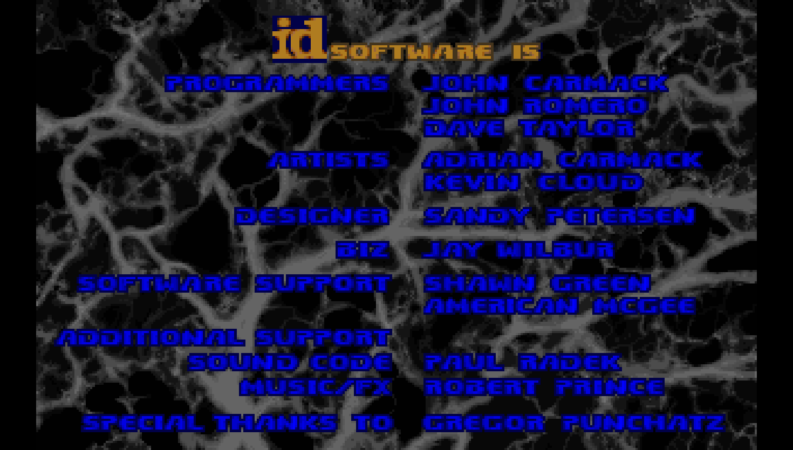

# Doom Perf

Doom Perf is a fork of the original `doom-typescript` browser port. The base
project brought the open-source Doom engine into the browser with TypeScript,
WebAssembly, WebGL, Web Audio, and Tone.js. This fork keeps that run/build
shape, then amends the game into a USE-methodology performance diagnostics lab.

The current goal is not to make a normal Doom game. It is to turn Doom into an
explorable systems observability space where CPU, memory, storage, and network
utilization, saturation, and errors become Doom rooms, props, gauges, and HUD
signals.



## Current Status

The project currently runs as a browser-hosted Doom experience using the same
esbuild and `public/` hosting flow as the fork source. The default runtime path
loads the patched Doom WASM engine, the shareware `Doom1.WAD`, and the generated
Doom Perf map PWAD.

What currently works:

- Browser Doom host served from `public/index.html`.
- TypeScript bundle built from `src/index.ts` into `public/dist/index.js`.
- Patched Doom WASM engine artifacts committed at `public/engine/doom.js` and
  `public/engine/doom.wasm`.
- Generated Doom Perf map PWAD at `public/maps/doomperf-lab.wad`.
- Go telemetry SSE service at `http://127.0.0.1:9999/telemetry`.
- Telemetry client in the browser that pushes live CPU values into the WASM
  engine through exported `DoomPerf_*` functions.
- Doom menu flow narrowed to Doom Perf's data-source selection.
- Three current data-source scenarios from the splash/menu flow:
  - `LIVE STATS`
  - `SIM: HIGH CPU UTILIZATION`
  - `SIM: HIGH CPU SATURATION`
- CPU room instruments for per-core utilization, run queue pressure, and load
  average pressure.
- Interactive terminal overlay near CPU wall terminals for core, run queue, and load
  readouts.
- Alternate `?renderer=webgl` path that renders the WAD with the TypeScript
  WebGL renderer and overlays telemetry in the Doom status bar.

What is still left:

- Complete memory, storage, and network scenarios beyond the current CPU-focused
  work.
- Add telemetry-driven memory, storage, and network room instruments in the
  patched WASM renderer.
- Expand interactive terminal overlays beyond CPU displays.
- Refine the CPU wing visual language per `VISUAL_REVAMP.md`, especially
  separating metric-bearing instruments from decorative Doom atmosphere.
- Add per-room music or audio cues.
- Investigate replacing the shareware IWAD dependency with Freedoom Phase 1 for
  a fully bundleable base asset set.
- Clean up strict TypeScript checking in the copied browser/WebGL sources. The
  supported project build is currently `npm run build`, which uses esbuild.

## Installation And Running

Prerequisites:

- Node.js 18 or newer
- npm
- Go 1.22 or newer for the local telemetry SSE service
- Emscripten SDK only if rebuilding the WASM engine
- A compatible Doom IWAD at `public/wads/Doom1.WAD`

Install dependencies:

```bash
npm install
```

Regenerate the Doom Perf map and build the browser bundle:

```bash
npm run build:map
npm run build
```

Start the browser host and Linux telemetry SSE service:

```bash
npm run dev:telemetry
```

Then open:

```text
http://localhost:8000
```

Useful URL variants:

```text
http://localhost:8000/
http://localhost:8000/?telemetry=http://127.0.0.1:9999/telemetry
http://localhost:8000/?telemetry=off
http://localhost:8000/?renderer=webgl
```

## Controls

| Key | Action |
| --- | --- |
| Arrow keys | Move and turn |
| Space | Open doors, use, or open/close nearby Doom Perf terminal overlays |
| Shift | Run |
| Esc | Menu or close terminal overlay |
| Tab | Automap |

Combat and weapon switching are intentionally disabled by engine patches. Doom
Perf is currently an observational lab, not a combat game.

## Data Sources

`npm run dev:telemetry` starts two processes:

- `go run ./cmd/telemetry`
- esbuild's static web host for `public/`

The Go service samples Linux state once per second and emits Server-Sent Events.
The current live feed includes:

- `/proc/stat` for aggregate and per-core CPU utilization
- `/proc/loadavg` for run queue and load pressure
- `/proc/meminfo` and `/proc/vmstat` for memory pressure
- `/proc/diskstats` for storage utilization, queue depth, latency, and I/O rate
- `/proc/net/dev` for network throughput, drops, and errors

The browser accepts either `telemetry` events or JSON `message` events. With no
query parameter it uses local telemetry on `localhost` and same-origin
telemetry everywhere else:

```text
http://127.0.0.1:9999/telemetry  # localhost development
/telemetry                       # production / iximiuz Labs
```

Use `?telemetry=same-origin` to force the production path locally, or
`?telemetry=off` to disable telemetry.

## iximiuz Labs Deployment

The iximiuz Labs playground scaffold lives under `playground/iximiuz/`. It
follows the same rootfs-image pattern as the `use-practice` playground:

- `playground/iximiuz/Dockerfile` builds the browser bundle and telemetry
  binary, then installs them into an iximiuz Ubuntu 24.04 rootfs image.
- Nginx listens on `0.0.0.0:8080`, serves `public/`, and proxies `/telemetry`
  and `/healthz` to the local Go telemetry service on `127.0.0.1:9999`.
- systemd starts `doomperf-telemetry`, `nginx`, and a bootstrap readiness check.
- `playground/iximiuz/manifest.yaml` exposes a terminal tab and a Doom Perf
  `http-port` tab on port `8080`. The tab serves a launcher at `/`; the game
  runs at `/game/` so it can be opened in a separate browser tab and receive
  direct keyboard input outside the iximiuz iframe.

Build and publish the rootfs image from the repository root:

```bash
docker build -f playground/iximiuz/Dockerfile -t ghcr.io/lpmi-13/doom-perf-rootfs:vTAG .
docker push ghcr.io/lpmi-13/doom-perf-rootfs:vTAG
```

Then publish or start the playground with `playground/iximiuz/manifest.yaml`.
The Doom Perf tab should open through the iximiuz-generated HTTPS domain. Click
`Open Game` from that tab to launch `/game/` in a separate browser tab; the
browser should connect to telemetry using the same origin at `/telemetry`.

## Architecture

```text
Browser
  public/index.html
    -> public/game/index.html
       -> public/dist/index.js
          -> patched Doom WASM engine
          -> Doom Perf PWAD
       -> telemetry EventSource

Local telemetry service
  cmd/telemetry/main.go
    -> /proc and /sys sampling
    -> SSE stream

Build inputs
  src/                 TypeScript browser host and renderers
  wasm/                Emscripten platform adapters
  patches/             Ordered linuxdoom-1.10 patches
  scripts/             map and engine build scripts
```

The original id Software C source is not committed here. The engine rebuild
script expects a clean external `linuxdoom-1.10` tree and stages it into
`.build/doom/linuxdoom-1.10` before applying Doom Perf patches.

## Doom Perf Engine Patches

The ordered patches under `patches/doom/linuxdoom-1.10/` are the source of
truth for changes to the Doom C engine:

| Patch | Purpose |
| --- | --- |
| `0001-hide-player-psprites.patch` | Hide first-person weapon sprites and muzzle flash. |
| `0002-hide-status-bar-hud.patch` | Use the full 320x200 view and suppress the original status bar. |
| `0003-disable-player-damage.patch` | Make the observer immune to damage. |
| `0004-suppress-monsters.patch` | Suppress monster and lost-soul spawning. |
| `0005-strip-map-items.patch` | Strip normal gameplay items while keeping selected lab props. |
| `0006-unlock-all-doors.patch` | Remove key requirements from locked doors. |
| `0007-cpu-core-floor-display.patch` | Add CPU floor instruments for cores and pressure. |
| `0008-allow-project-pwads.patch` | Allow the project PWAD with the local shareware IWAD. |
| `0009-allow-pwad-sprite-overrides.patch` | Allow project sprite replacements for lab signs. |
| `0010-disable-combat-controls.patch` | Ignore fire and weapon-selection controls. |
| `0011-title-page-only.patch` | Hold the opening title page instead of cycling demos. |
| `0012-simplify-title-menus.patch` | Simplify the title menu for Doom Perf. |
| `0013-cpu-core-column-streaks.patch` | Add telemetry-driven rising streaks to CPU pillars. |
| `0014-sim-modes-and-level-select.patch` | Add live/utilization/saturation data-source selection. |
| `0015-cpu-pillar-sink.patch` | Raise or sink CPU pillars based on available logical CPUs. |
| `0016-cpu-core-pads.patch` | Add per-core colored pads under CPU pillars. |
| `0017-cpu-load-gauges.patch` | Add load average gauges for 1m, 5m, and 15m pressure. |

Rebuild the engine from a clean Doom source checkout:

```bash
DOOM_SRC_DIR=/path/to/DOOM/linuxdoom-1.10 npm run build:engine
```

`DOOM_PATCH_DIR` overrides the patch directory and `DOOM_PLATFORM_DIR` overrides
the Emscripten adapter directory.

## Doom Perf Map

The readable map generator is `scripts/build-doomperf-map.mjs`. It writes:

```text
public/maps/doomperf-lab.wad
```

The map currently provides a central atrium and labeled CPU, memory, storage,
and network wings. CPU is the implemented telemetry-driven wing. The other
resource wings are present as map structure and labels, but their full
telemetry-driven instruments are still planned.

Regenerate the map with:

```bash
npm run build:map
```

## Build Commands

| Command | Purpose |
| --- | --- |
| `npm run build` | Bundle `src/index.ts` to `public/dist/index.js` with esbuild. |
| `npm run dev` | Bundle and serve `public/` with esbuild watch mode. |
| `npm run dev:telemetry` | Run the Go telemetry service and esbuild web host together. |
| `npm run build:map` | Regenerate `public/maps/doomperf-lab.wad`. |
| `npm run build:engine` | Rebuild `public/engine/doom.js` and `public/engine/doom.wasm`. |

## Repository Map

| Path | Role |
| --- | --- |
| `src/index.ts` | Browser entry point and WASM/WebGL renderer selection. |
| `src/telemetry.ts` | Telemetry normalization and terminal overlay rendering. |
| `src/engine_bootstrap.ts` | WASM engine bootstrap and data file mounting. |
| `src/webgl_bootstrap.ts` | Alternate TypeScript WebGL renderer bootstrap. |
| `src/engine-webgl/` | TypeScript WAD parsing and WebGL rendering path. |
| `cmd/telemetry/main.go` | Linux SSE telemetry service. |
| `scripts/build-doomperf-map.mjs` | Project PWAD generator. |
| `scripts/build-doom-wasm.sh` | Patch and compile pipeline for the Doom C engine. |
| `wasm/` | Emscripten adapters and Doom Perf bridge globals. |
| `patches/doom/linuxdoom-1.10/` | Ordered engine patches. |
| `public/engine/` | Generated patched engine artifacts. |
| `public/maps/` | Generated Doom Perf PWAD. |
| `public/wads/` | Runtime IWAD files. |
| `VISUAL_REVAMP.md` | Design notes for the CPU wing revamp. |

## License

The original Doom source code is released under GPLv2. Doom IWAD data is owned
by id Software and has separate distribution terms. Doom Perf keeps the
browser-port code under the same GPLv2-compatible footing as the forked
`doom-typescript` project.

## Acknowledgments

- id Software for open-sourcing the Doom engine
- The original `doom-typescript` browser port this project was forked from
- GitHub Copilot CLI for the original browser-port migration work
- Playwright MCP for browser rendering and scaling debugging
