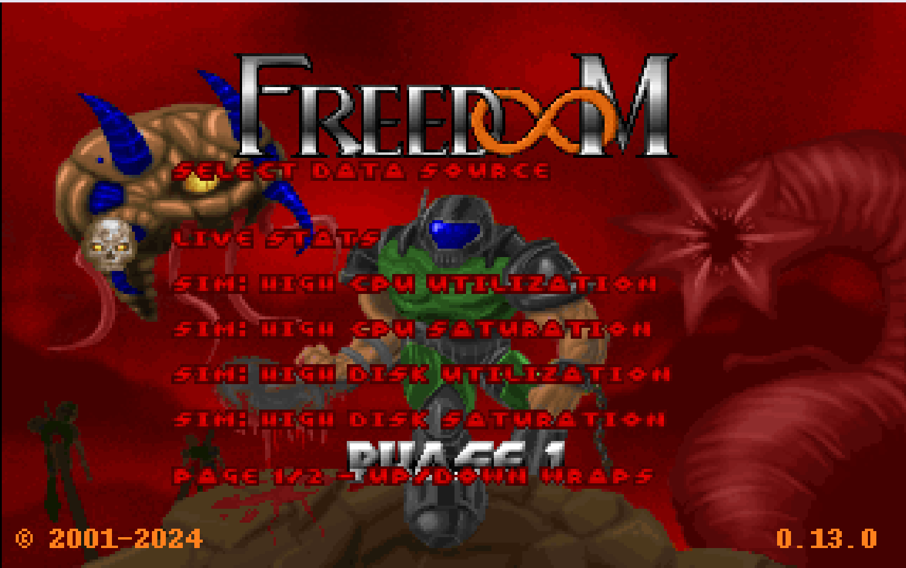
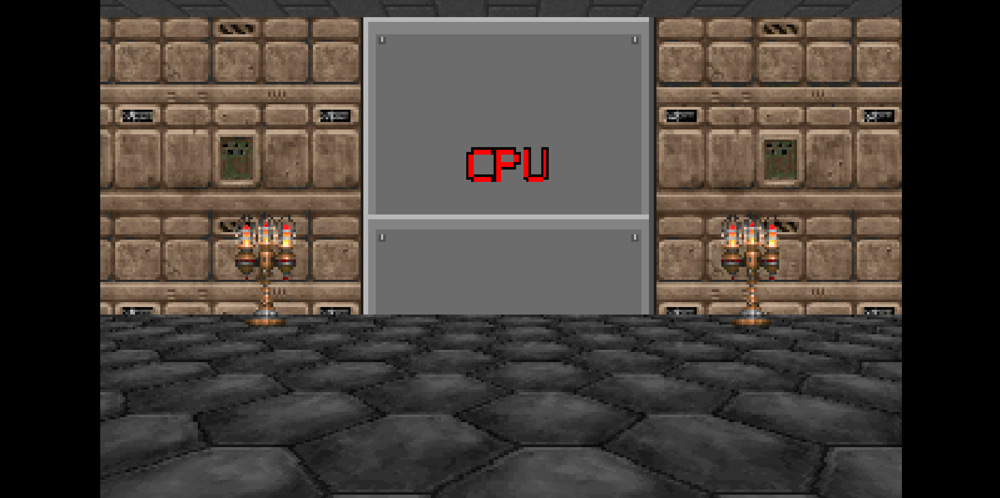
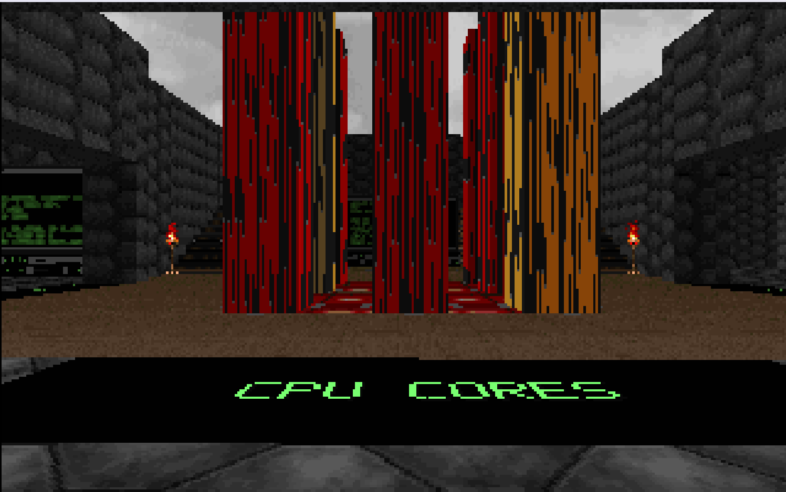
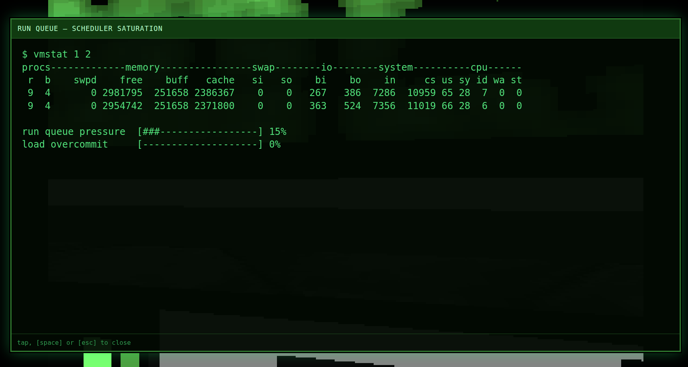
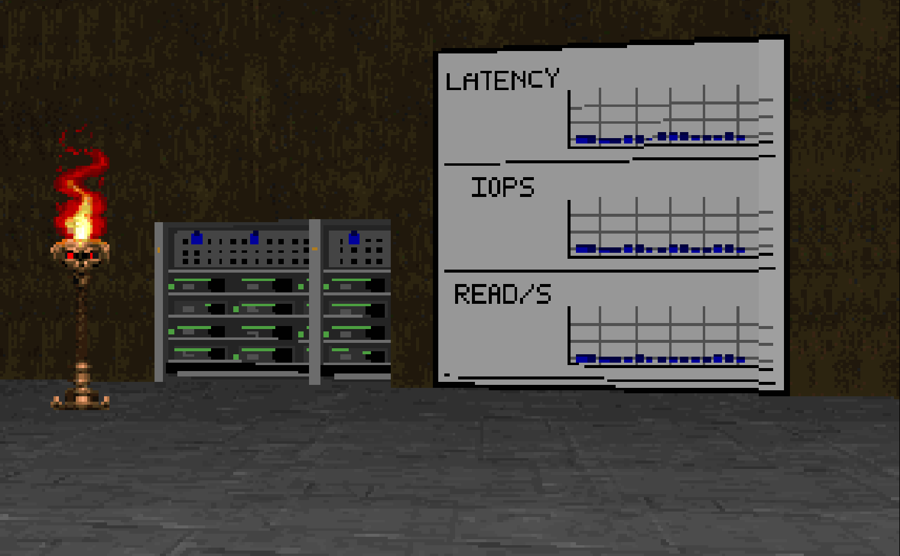

# Doom Perf

Doom Perf is a fork of the original
[doom-typescript](https://github.com/pascalvanderheiden/doom-typescript)
browser port. The base project brought the open-source Doom engine into the
browser with TypeScript, WebAssembly, Web Audio, and Tone.js. This fork keeps
that run/build shape, then amends the game into a USE-methodology performance
diagnostics lab.

The current goal is not to make a normal Doom game. It is to turn Doom into an
explorable systems observability space where CPU, memory, storage, and network
utilization, saturation, and errors become Doom rooms, props, gauges, and HUD
signals.











## Current Status

You can run this live in an [iximiuz Labs playground](https://labs.iximiuz.com/playgrounds/doom-perf-c0bd32e1)!

The project currently runs as a browser-hosted Doom diagnostics lab using the
same esbuild and `public/` hosting flow as the fork source. The default runtime
path loads the patched Doom WASM engine, the redistributable Freedoom Phase 1
`freedoom1.wad` IWAD, and the generated Doom Perf map PWAD.

What currently works:

- Browser launcher at `public/index.html` and the full-screen game host at
  `public/game/index.html`.
- TypeScript bundle built from `src/index.ts` into `public/dist/index.js`.
- Patched Doom WASM engine artifacts committed at `public/engine/doom.js` and
  `public/engine/doom.wasm`.
- Generated Doom Perf map PWAD at `public/maps/doomperf-lab.wad`.
- Central atrium with four themed resource wings: CPU, memory, disk, and
  network.
- Go telemetry SSE service at `http://127.0.0.1:9999/telemetry`.
- Telemetry client in the browser that normalizes live/simulated resource data
  and pushes live CPU, memory, and storage values into the WASM engine through
  exported `DoomPerf_*` functions.
- Doom menu flow narrowed to Doom Perf's data-source selection.
- Nine current data-source choices from the splash/menu flow:
  - `LIVE STATS`
  - `SIM: HIGH CPU UTILIZATION`
  - `SIM: HIGH CPU SATURATION`
  - `SIM: HIGH DISK UTILIZATION`
  - `SIM: HIGH DISK SATURATION`
  - `SIM: HIGH MEMORY UTILIZATION`
  - `SIM: HIGH MEMORY SATURATION`
  - `SIM: HIGH NETWORK UTILIZATION`
  - `SIM: HIGH NETWORK SATURATION`
- CPU wing instruments for per-core utilization, run queue pressure, blocked
  I/O-wait tasks, and load average pressure.
- Memory wing instruments for page-bank utilization, swap/PSI saturation, and
  OOM error state.
- Storage wing instruments for disk utilization, queue depth, service latency,
  and a scrolling metrics dashboard.
- Network wing map structure for RX/TX lanes, NIC bays, choke, drops, errors,
  and a `/proc/net/dev` terminal.
- Interactive terminal overlays for CPU (`mpstat`, `vmstat`, `uptime`), memory
  (`free`, top RSS, swap, PSI, OOM), storage (`iostat -x`), and network
  (`/proc/net/dev`) readouts.
- Touch-device support for menu navigation, movement, the USE/interact prompt,
  and a long-press on the game view to reopen the data-source menu (the phone's
  equivalent of Esc) so a different sim can be selected mid-run.
- Disk server-rack easter egg that plays an interaction sting and spikes the
  storage metrics dashboard.

What is still left:

- Add live engine-driven visual instruments for the network wing. Network
  telemetry and terminals exist today, but the RX/TX lanes, choke, drop basin,
  and error drain are still static map geometry.
- Continue refining resource-wing visual language, especially making
  metric-bearing instruments distinct from decorative Doom atmosphere.
- Add more per-room music or audio cues beyond the current interaction sting.
- Clean up strict TypeScript checking in the copied browser sources. The
  supported project build is currently `npm run build`, which uses esbuild.

## Installation And Running

Prerequisites:

- Node.js 18 or newer
- npm
- Go 1.22 or newer for the local telemetry SSE service
- Emscripten SDK only if rebuilding the WASM engine
- The bundled Freedoom Phase 1 IWAD at `public/wads/freedoom1.wad`

Install dependencies:

```bash
npm install
```

Regenerate the Doom Perf map and build the browser bundle:

```bash
npm run build:map
npm run build
```

Start the browser host and Linux telemetry SSE service:

```bash
npm run dev:telemetry
```

Then open:

```text
http://localhost:8000
```

Useful URL variants:

```text
http://localhost:8000/
http://localhost:8000/?telemetry=off
```

## Controls

| Key | Action |
| --- | --- |
| Arrow keys | Move and turn |
| Space | Open doors, use, or open/close nearby Doom Perf terminal overlays |
| Shift | Run |
| Esc | Menu or close terminal overlay |
| Tab | Automap |

Combat and weapon switching are intentionally disabled by engine patches. Doom
Perf is currently an observational lab, not a combat game.

On touch devices, the browser host adds menu buttons on the title/menu screens,
a movement pad in-game, and an on-screen USE/interact prompt near doors and
terminal screens. A long-press on the game view acts as Esc: it reopens the
data-source menu so you can back out of the running sim and pick a different one
(the ▲▼/SELECT/BACK buttons replace the movement pad while it is open), and a
second long-press closes it again.

## Data Sources

`npm run dev:telemetry` starts two processes:

- `go run ./cmd/telemetry` (the SSE collector on `127.0.0.1:9999`)
- the dev web server (`scripts/build-web.mjs --watch --serve`), which serves
  `public/` and the in-memory bundle, and proxies `/telemetry` and `/healthz`
  to the collector — the same same-origin fronting nginx provides in prod.

The Go service samples Linux state once per second and emits Server-Sent Events.
The current live feed includes:

- `/proc/stat` for aggregate and per-core CPU utilization
- `/proc/loadavg` for run queue and load pressure
- `/proc/meminfo` and `/proc/vmstat` for memory pressure
- `/proc/diskstats` for storage utilization, queue depth, latency, and I/O rate
- `/proc/net/dev` for network throughput, drops, and errors

The browser accepts either `telemetry` events or JSON `message` events. With no
query parameter it always connects same-origin to `/telemetry`:

```text
/telemetry   # dev: dev-server proxy -> 127.0.0.1:9999
/telemetry   # prod / iximiuz Labs: nginx -> 127.0.0.1:9999
```

Because the request is same-origin in both environments, the collector serves no
CORS headers. Use `?telemetry=off` to disable telemetry, or
`?telemetry=<url>` to point at a loopback collector directly (restricted to the
`127.0.0.1:9999` / `localhost:9999` dev endpoint by the client).

## CPU Errors Are Intentionally Not Visualized

Doom Perf maps the full USE triad — utilization, saturation, and errors — onto
the lab, but the CPU wing deliberately ships only **utilization** (per-core
instruments) and **saturation** (run queue and load gauges). There is no CPU
**errors** instrument, and that omission is intentional.

In Brendan Gregg's USE method, a CPU *error* is a hardware fault: a Machine
Check Exception (MCE), an ECC/cache parity error, or thermal throttling. Those
are surfaced through `/sys/devices/system/machinecheck/`, the EDAC counters
under `/sys/devices/system/edac/mc/`, the per-core `thermal_throttle` counters
under `/sys/devices/system/cpu/`, or the kernel log.

Utilization and saturation are products of *workload* — any unprivileged process
can produce them on demand (a busy loop for utilization, an oversubscribed run
queue for saturation). A genuine CPU error is a product of *hardware*, and
userspace cannot make one happen. The only facilities that can fabricate one
deterministically are:

- `mce-inject` — software injection of a synthetic MCE record into the kernel's
  machine-check path (needs `CONFIG_X86_MCE_INJECT`, root, and the
  `/sys/kernel/debug/mce-inject` debugfs node).
- ACPI APEI `einj` — firmware-mediated injection through the platform's real
  error hardware (needs `CONFIG_ACPI_APEI_EINJ`, root, debugfs, and server-class
  firmware that implements the EINJ table).

Both require root and debugfs, EINJ additionally requires server firmware, and
neither exists inside the unprivileged container the lab runs in (iximiuz Labs).
Scraping `dmesg`/`journalctl` is not a workaround either: `dmesg_restrict`
blocks unprivileged kernel-log reads, so it would mean granting the collector
root/`CAP_SYSLOG` and shelling out — abandoning its clean, unprivileged
`/proc` + `/sys` design.

The upshot is that a live CPU error instrument would read zero in every
environment Doom Perf actually runs in, with no reliable way to demonstrate a
non-zero state, so it is omitted rather than shown as a permanently dead gauge.
The data model itself already carries `errors` for every resource
(`src/telemetry/types.ts`), and the collector populates it where an error signal
is reachable: **memory** errors from OOM kills (`/proc/vmstat` `oom_kill`) and
**network** errors from NIC RX/TX error counters (`/proc/net/dev`). CPU is simply
the one resource whose USE error is purely a hardware fault.

## iximiuz Labs Deployment

The iximiuz Labs playground scaffold lives under `playground/iximiuz/`. It
follows the same rootfs-image pattern as the `use-practice` playground:

- `playground/iximiuz/Dockerfile` builds the browser bundle and telemetry
  binary, then installs them into an iximiuz Ubuntu 24.04 rootfs image.
- Nginx listens on `0.0.0.0:8080`, serves `public/`, and proxies `/telemetry`
  and `/healthz` to the local Go telemetry service on `127.0.0.1:9999`.
- systemd starts `doomperf-telemetry`, `nginx`, and a bootstrap readiness check.
- `playground/iximiuz/manifest.yaml` exposes a terminal tab and a Doom Perf
  `http-port` tab on port `8080`. The tab serves a launcher at `/`; the game
  runs at `/game/` so it can be opened in a separate browser tab and receive
  direct keyboard input outside the iximiuz iframe.

Build and publish the rootfs image from the repository root:

```bash
docker build -f playground/iximiuz/Dockerfile -t ghcr.io/lpmi-13/doom-perf-rootfs:vTAG .
docker push ghcr.io/lpmi-13/doom-perf-rootfs:vTAG
```

Then publish or start the playground with `playground/iximiuz/manifest.yaml`.
The Doom Perf tab should open through the iximiuz-generated HTTPS domain. Click
`Open Game` from that tab to launch `/game/` in a separate browser tab; the
browser should connect to telemetry using the same origin at `/telemetry`.

## Architecture

```text
Browser
  public/index.html
    -> public/game/index.html
       -> public/dist/index.js
          -> patched Doom WASM engine
          -> Doom Perf PWAD
       -> telemetry EventSource

Local telemetry service
  cmd/telemetry/main.go
    -> /proc and /sys sampling
    -> SSE stream

Build inputs
  src/                 TypeScript browser host, telemetry, and UI
  wasm/                Emscripten platform adapters
  patches/             Ordered linuxdoom-1.10 patches
  scripts/             map and engine build scripts
```

The original id Software C source is not committed here. The engine rebuild
script expects a clean external `linuxdoom-1.10` tree and stages it into
`.build/doom/linuxdoom-1.10` before applying Doom Perf patches.

## Doom Perf Engine Patches

The ordered patches under `patches/doom/linuxdoom-1.10/` are the source of
truth for changes to the Doom C engine:

| Patch | Purpose |
| --- | --- |
| `0001-hide-player-psprites.patch` | Hide first-person weapon sprites and muzzle flash. |
| `0002-hide-status-bar-hud.patch` | Use the full 320x200 view and suppress the original status bar. |
| `0003-disable-player-damage.patch` | Make the observer immune to damage. |
| `0004-suppress-monsters.patch` | Suppress monster and lost-soul spawning. |
| `0005-strip-map-items.patch` | Strip normal gameplay items while keeping selected lab props. |
| `0006-unlock-all-doors.patch` | Remove key requirements from locked doors. |
| `0007-cpu-core-floor-display.patch` | Add CPU floor instruments for cores and pressure. |
| `0008-allow-project-pwads.patch` | Allow the project PWAD with the base IWAD. |
| `0009-allow-pwad-sprite-overrides.patch` | Allow project sprite replacements for lab signs. |
| `0010-disable-combat-controls.patch` | Ignore fire and weapon-selection controls. |
| `0011-title-page-only.patch` | Hold the opening title page instead of cycling demos. |
| `0012-simplify-title-menus.patch` | Simplify the title menu for Doom Perf. |
| `0013-cpu-core-column-streaks.patch` | Add telemetry-driven rising streaks to CPU pillars. |
| `0014-sim-modes-and-level-select.patch` | Add live/utilization/saturation data-source selection. |
| `0015-cpu-pillar-sink.patch` | Raise or sink CPU pillars based on available logical CPUs. |
| `0016-cpu-core-pads.patch` | Add per-core colored pads under CPU pillars. |
| `0017-cpu-load-gauges.patch` | Add load average gauges for 1m, 5m, and 15m pressure. |
| `0018-run-queue-particles.patch` | Add animated runnable-task and blocked I/O-wait orbs in the CPU run-queue room. |
| `0019-remove-use-grunt.patch` | Suppress the original USE wall-bump grunt around terminal screens. |
| `0020-disk-sim-modes.patch` | Add disk utilization and saturation simulation menu modes. |
| `0021-disk-latency-gauges.patch` | Add storage service-latency wall gauges driven by `await`. |
| `0022-disk-platter-pulse.patch` | Pulse storage platter rings from disk utilization. |
| `0023-disk-queue-channel.patch` | Add storage queue-depth floor blocks driven by `aqu-sz`. |
| `0024-memory-sim-modes.patch` | Add memory utilization and saturation simulation menu modes. |
| `0025-memory-page-bank.patch` | Animate memory page cells, swap channels, PSI pads, and the OOM alcove. |
| `0026-network-sim-modes.patch` | Add paged data-source menu support and network simulation modes. |
| `0027-disk-metrics-dashboard.patch` | Add the storage metrics dashboard with scrolling latency, IOPS, and read graphs. |
| `0028-cpu-load-gauge-single-band.patch` | Restrict CPU load gauge rendering to the intended wall surface. |
| `0029-cpu-load-gauge-redesign.patch` | Redesign CPU load gauges as full-height, sim-aware utilization/saturation bars. |

Rebuild the engine from a clean Doom source checkout:

```bash
DOOM_SRC_DIR=/path/to/DOOM/linuxdoom-1.10 npm run build:engine
```

`DOOM_PATCH_DIR` overrides the patch directory and `DOOM_PLATFORM_DIR` overrides
the Emscripten adapter directory.

## Doom Perf Map

The readable map generator is `scripts/build-doomperf-map.mjs`. It writes:

```text
public/maps/doomperf-lab.wad
```

The map currently provides a central atrium and labeled CPU, memory, storage,
and network wings.

- CPU is fully instrumented with a core chamber, run-queue subway, blocked-task
  pen, and load-average gauge room.
- Memory is instrumented with a page bank, cache reservoir, swap channels, PSI
  pads, an OOM alcove, and five terminal read points.
- Storage is instrumented with read/write bays, a service queue channel, a
  pulsing platter, latency gauges, a scrolling metrics dashboard, and an
  `iostat` terminal.
- Network has its full static wing layout and terminal: RX/TX lanes, NIC bays,
  choke, drop basin, error drain, and `/proc/net/dev` readout. Live renderer
  hooks for those network surfaces are the main remaining resource-wing gap.

Regenerate the map with:

```bash
npm run build:map
```

## Build Commands

| Command | Purpose |
| --- | --- |
| `npm run build` | Bundle `src/index.ts` to `public/dist/index.js` with esbuild. |
| `npm run dev` | Bundle and serve `public/` with esbuild watch mode. |
| `npm run dev:telemetry` | Run the Go telemetry service and esbuild web host together. |
| `npm run build:map` | Regenerate `public/maps/doomperf-lab.wad`. |
| `npm run build:engine` | Rebuild `public/engine/doom.js` and `public/engine/doom.wasm`. |
| `npm run test:go` | Run Go telemetry service tests. |
| `npm run typecheck` | Run TypeScript checking. This is stricter than the supported esbuild bundle path. |
| `npm run check` | Run typecheck, Go tests, and the browser bundle build. |

## Repository Map

| Path | Role |
| --- | --- |
| `src/index.ts` | Browser entry point: WASM engine, telemetry, and UI wiring. |
| `src/telemetry.ts` | Public telemetry exports for the browser entry point. |
| `src/telemetry/` | Telemetry source resolution, SSE client, normalization, and shared types. |
| `src/ui/terminalOverlay.ts` | Linux-command-style terminal overlay renderers for the resource wings. |
| `src/ui/movementPad.ts` | Touch movement controls. |
| `src/ui/menuControls.ts` | Touch menu controls. |
| `src/engine_bootstrap.ts` | WASM engine bootstrap and data file mounting. |
| `cmd/telemetry/main.go` | Linux SSE telemetry service. |
| `scripts/build-doomperf-map.mjs` | Project PWAD generator. |
| `scripts/lib/wings/` | Self-contained CPU, memory, storage, and network wing builders. |
| `scripts/build-doom-wasm.sh` | Patch and compile pipeline for the Doom C engine. |
| `wasm/` | Emscripten adapters and Doom Perf bridge globals. |
| `patches/doom/linuxdoom-1.10/` | Ordered engine patches. |
| `public/engine/` | Generated patched engine artifacts. |
| `public/maps/` | Generated Doom Perf PWAD. |
| `public/wads/` | Runtime IWAD files and Freedoom license notice. |
| `VISUAL_REVAMP.md` | Design notes for the CPU wing revamp. |

## License

The original Doom source code is released under GPLv2. Doom Perf keeps the
browser-port code under the same GPLv2-compatible footing as the forked
`doom-typescript` project.

The bundled base IWAD is Freedoom Phase 1 (`public/wads/freedoom1.wad`), which
is distributed under the Freedoom license notice in `public/wads/COPYING.txt`.
Local `Doom1.WAD` files are not required and are intentionally ignored/excluded
from Docker packaging.

## Acknowledgments

- id Software for open-sourcing the Doom engine
- The original `doom-typescript` browser port this project was forked from
- GitHub Copilot CLI for the original browser-port migration work
- Playwright MCP for browser rendering and scaling debugging
